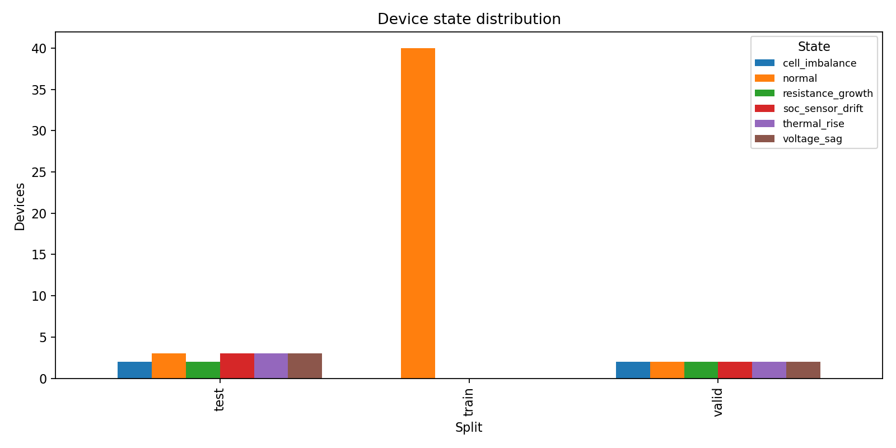
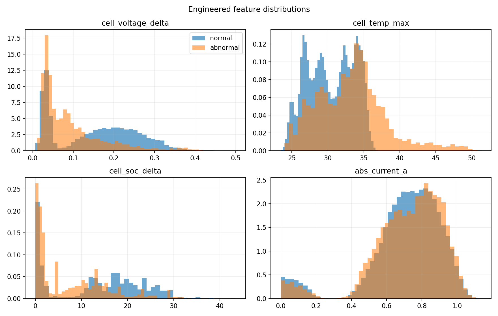
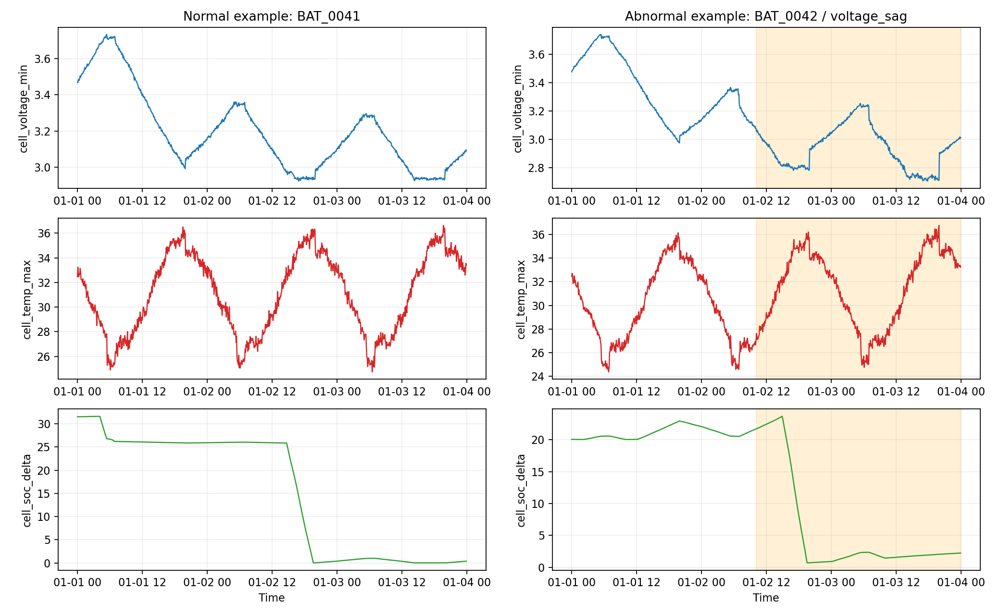
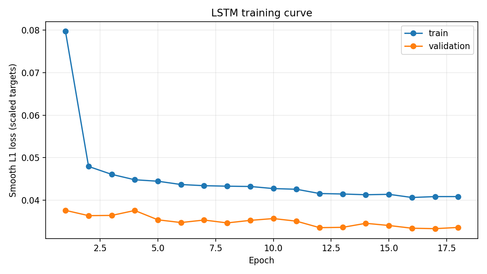
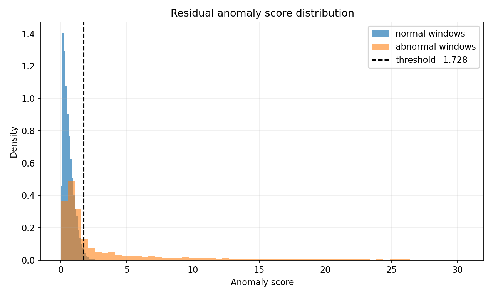
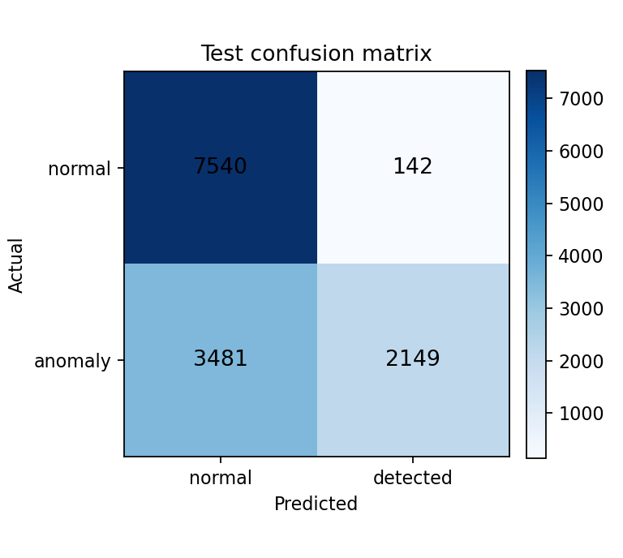
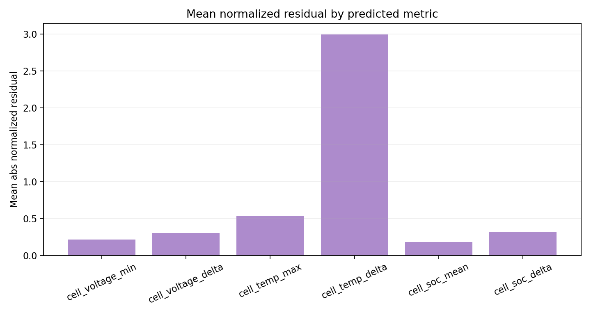
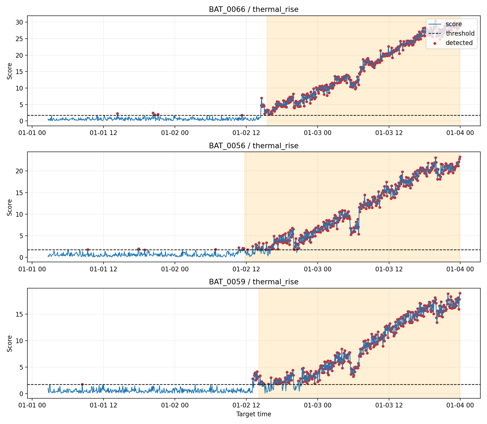

# Battery LSTM Residual Anomaly Detection Report

## Objective

This mini-project trains an LSTM forecaster on normal lithium battery BMS sequences.
At inference time, the model predicts future voltage, temperature, and SOC indicators.
A residual score above the train-normal high-quantile threshold is flagged as anomalous.

## Pipeline

1. Simulate physically constrained 8-cell BMS time series.
2. Engineer pack-level features such as cell voltage spread, max temperature, SOC spread, current state, time-of-day phase, and throughput.
3. Train an LSTM next-horizon forecaster using only normal training devices.
4. Score validation and test windows from normalized residuals.
5. Use the train residual quantile as the anomaly threshold and evaluate point-level and device-level detection.

## Key Configuration

- Rated capacity: `17.0 Ah`
- Cells: `8`
- Sample interval: `5 minutes`
- Sequence length: `30`
- Forecast horizon: `3`
- Threshold quantile: `0.985`
- Learned threshold: `1.7281`
- Best epoch: `17`

## Split Metrics

| split | windows | positives | threshold | accuracy | precision | recall | f1 | roc_auc | average_precision | tn | fp | fn | tp |
| --- | --- | --- | --- | --- | --- | --- | --- | --- | --- | --- | --- | --- | --- |
| train | 33280 | 0 | 1.7281 | 0.9850 | 0.0000 | 0.0000 | 0.0000 |  |  | 32780 | 500 | 0 | 0 |
| valid | 9984 | 4160 | 1.7281 | 0.7309 | 0.9445 | 0.3762 | 0.5381 | 0.8035 | 0.7969 | 5732 | 92 | 2595 | 1565 |
| test | 13312 | 5630 | 1.7281 | 0.7278 | 0.9380 | 0.3817 | 0.5426 | 0.7835 | 0.7798 | 7540 | 142 | 3481 | 2149 |

## State Metrics

| split | state_label | windows | positive_windows | detected_windows | detection_rate | recall_if_abnormal | mean_score | p95_score |
| --- | --- | --- | --- | --- | --- | --- | --- | --- |
| valid | normal | 1664 | 0 | 29 | 0.0174 | 0.0000 | 0.5878 | 1.4037 |
| valid | voltage_sag | 1664 | 974 | 139 | 0.0835 | 0.1283 | 0.9240 | 1.9298 |
| valid | soc_sensor_drift | 1664 | 729 | 28 | 0.0168 | 0.0219 | 0.7231 | 1.4505 |
| valid | resistance_growth | 1664 | 715 | 347 | 0.2085 | 0.4769 | 1.3715 | 5.5027 |
| valid | thermal_rise | 1664 | 1004 | 841 | 0.5054 | 0.8177 | 5.5836 | 22.7148 |
| valid | cell_imbalance | 1664 | 738 | 273 | 0.1641 | 0.3550 | 1.2004 | 5.1637 |
| test | voltage_sag | 2496 | 1461 | 244 | 0.0978 | 0.1533 | 0.8456 | 2.3229 |
| test | soc_sensor_drift | 2496 | 1196 | 45 | 0.0180 | 0.0242 | 0.7806 | 1.5303 |
| test | cell_imbalance | 1664 | 935 | 221 | 0.1328 | 0.2246 | 0.9316 | 2.9509 |
| test | thermal_rise | 2496 | 1232 | 1189 | 0.4764 | 0.9351 | 6.1463 | 22.5943 |
| test | resistance_growth | 1664 | 806 | 548 | 0.3293 | 0.6625 | 2.3059 | 8.8801 |
| test | normal | 2496 | 0 | 44 | 0.0176 | 0.0000 | 0.6028 | 1.4010 |

## Device-Level Summary

- Abnormal devices detected: `23/23`
- Normal-window false alarm rate: `1.73%`
- Device maintenance decisions should add persistence or hysteresis on top of raw window alarms.

### Device State Distribution

### Feature Distributions

### Raw Time-Series Examples

### Training Curve

### Residual Score Distribution

### Test Confusion Matrix

### Residual Contributors

### Anomaly Timeline Examples

## Interpretation

The detector is intentionally unsupervised with respect to fault labels: labels are only used for validation.
Voltage-minimum, voltage-spread, temperature-maximum, temperature-spread, SOC-mean, and SOC-spread residuals are weighted because they map to common BMS risks: cell sag, imbalance, heat rise, and sensor drift.
The threshold is derived from train-normal residuals, so the operating point is easy to tighten or relax by changing `threshold_quantile`.